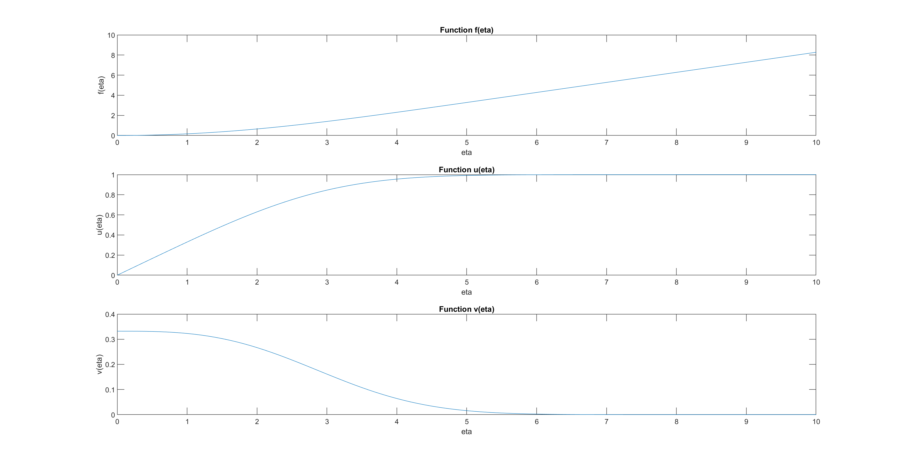

# Blassius solution for laminar boundary layer

The objective is to obtain the Blasius solution for laminar boundary layer over
a flat plate in zero pressure gradient numerically using Runge-Kutta method
and Newton-Raphson methods.

The report is available as [a pdf file](AM5530_Programming_Assignment.pdf).
The code is available in the code folder. To run the simulation, run the [*Programming_Assignment*](Programming_Assignment.m) file.
## Figures

## Tables
| Eta  | F         | U         | V        |
|------|-----------|-----------|----------|
| 0    | 0         | 0         | 0.332057 |
| 1    | 0.165572  | 0.32978   | 0.323007 |
| 2    | 0.650024  | 0.629766  | 0.266752 |
| 3    | 1.396808  | 0.846044  | 0.16136  |
| 4    | 2.305747  | 0.955518  | 0.064234 |
| 5    | 3.283274  | 0.991542  | 0.015907 |
| 6    | 4.279621  | 0.998973  | 0.002402 |
| 7    | 5.279239  | 0.999922  | 0.00022  |
| 8    | 6.279214  | 0.999996  | 1.22E-05 |
| 9    | 7.279213  | 1         | 4.13E-07 |
| 10   | 8.279212  | 1         | 8.46E-09 |
